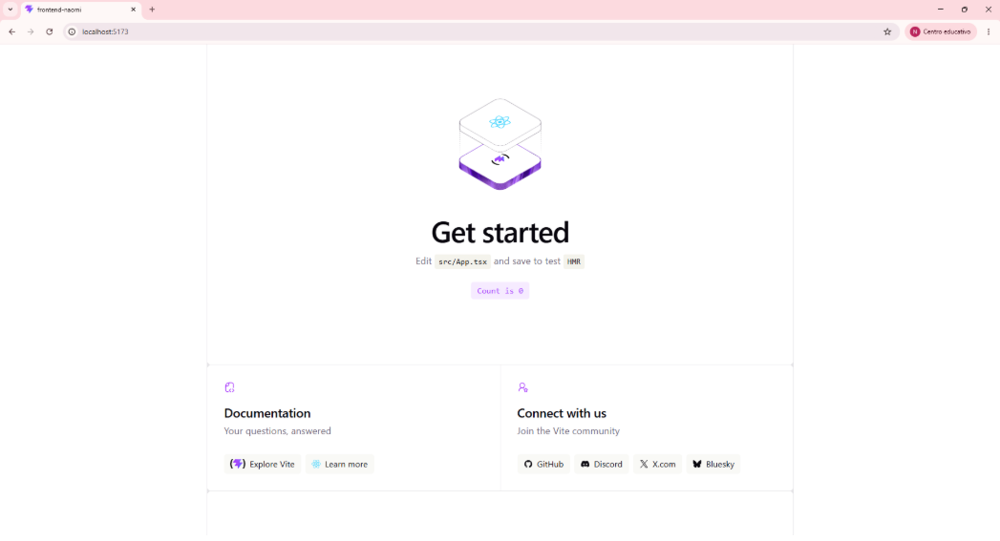
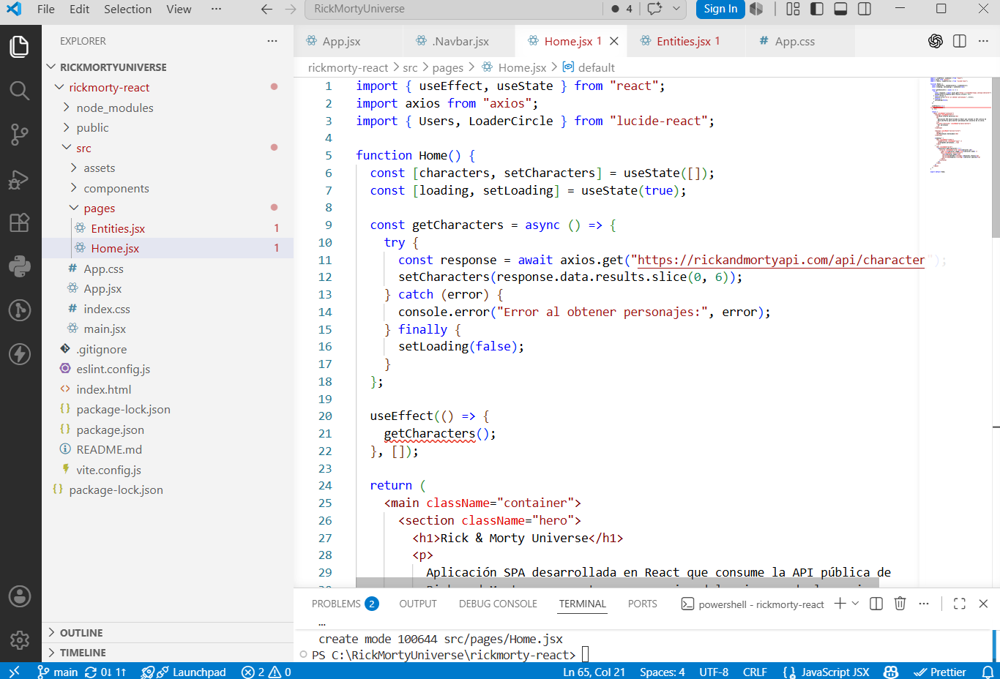
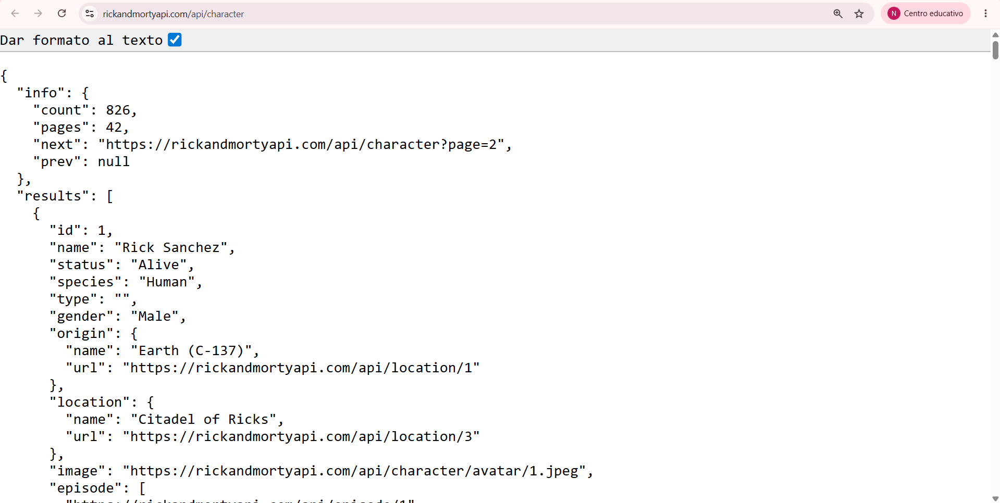
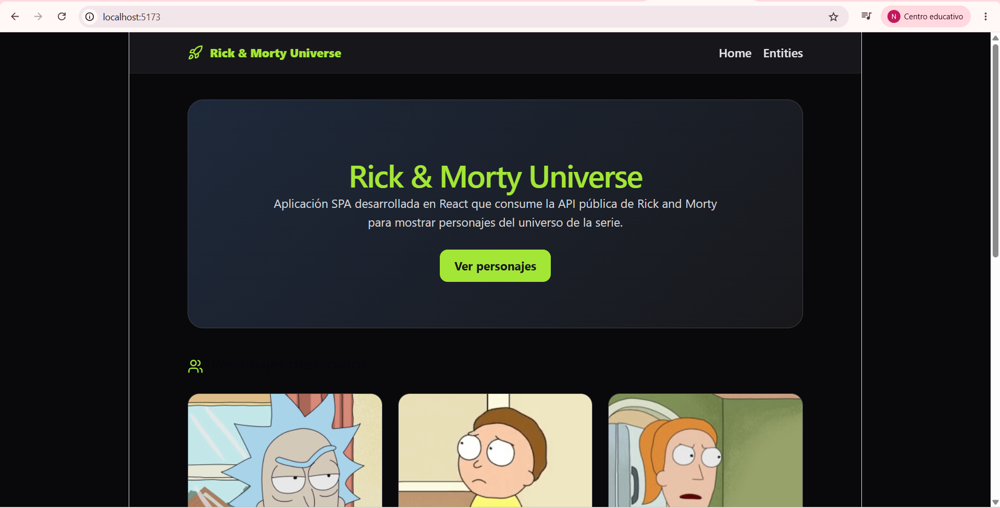
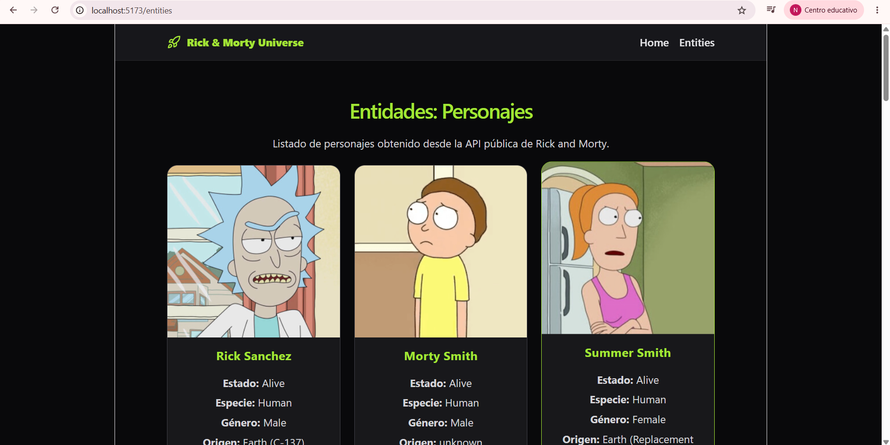
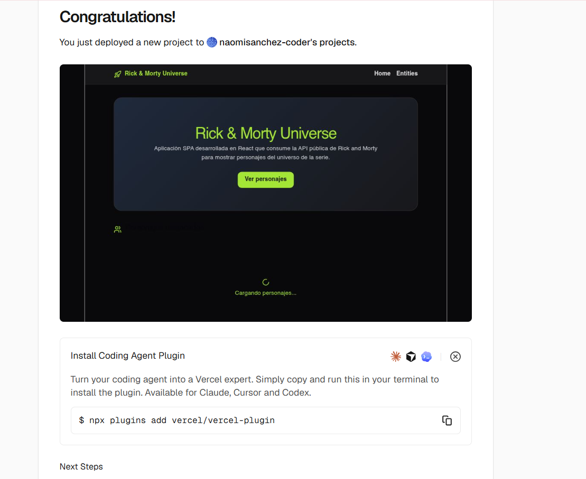
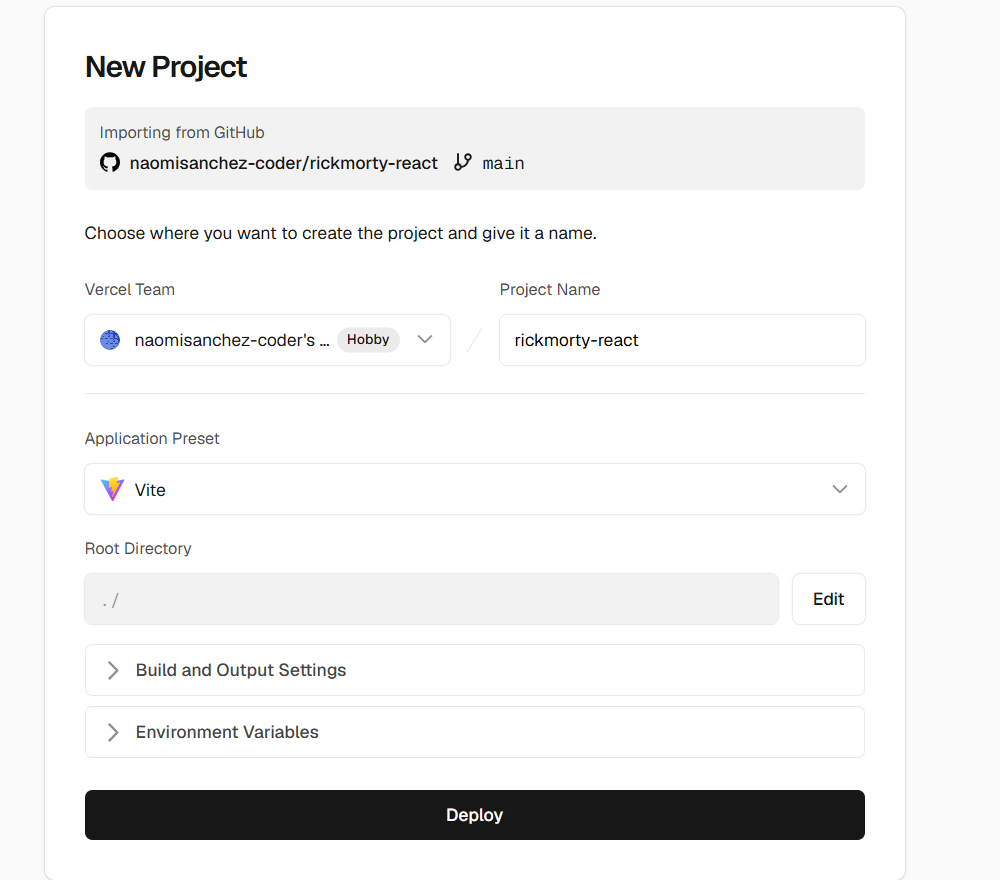
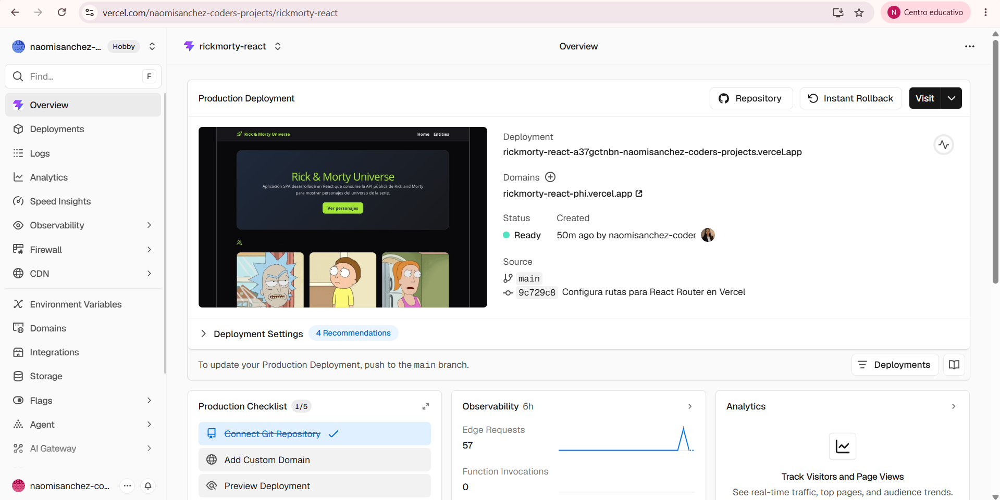
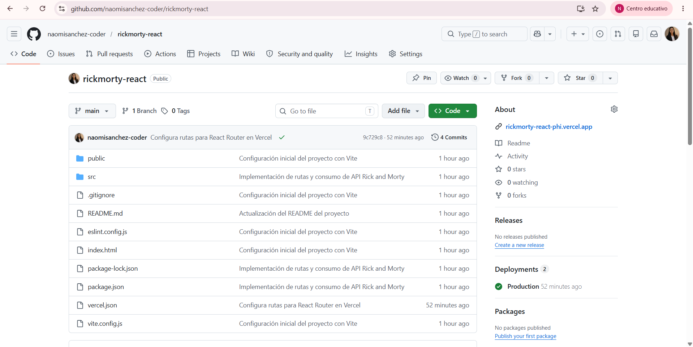

# Rick & Morty Universe

Aplicación SPA desarrollada en React que consume la API pública de Rick and Morty para mostrar información de personajes del universo de la serie.

---

## Descripción del Proyecto

Rick & Morty Universe es una aplicación web desarrollada con React y Vite que consume la API pública de Rick and Morty para mostrar personajes de la serie mediante una interfaz moderna y amigable.

La aplicación implementa navegación entre rutas utilizando React Router y obtiene información en tiempo real desde la API pública mediante Axios.

---

## Tecnologías Utilizadas

* React 19
* Vite
* React Router DOM
* Axios
* Lucide React
* CSS
* Vercel

---

## API Utilizada

API pública de Rick & Morty:

https://rickandmortyapi.com/api/character

---

## Funcionalidades Implementadas

### Configuración Inicial

* Proyecto creado con Vite.
* Estructura organizada por componentes y páginas.
* Configuración de React Router.

### Consumo de API

* Obtención de personajes desde la API pública.
* Uso de Axios para realizar peticiones HTTP.
* Renderizado dinámico de información.

### Ruta Home (/)

* Hero principal del proyecto.
* Descripción de la aplicación.
* Listado de personajes destacados obtenidos desde la API.

### Ruta Entities (/entities)

* Listado de personajes.
* Visualización de múltiples propiedades:

  * Nombre
  * Estado
  * Especie
  * Género
  * Origen

### Navegación

* Implementación de React Router DOM.
* Navegación entre Home y Entities.

### Estilos

* Diseño moderno inspirado en componentes tipo Shadcn.
* Cards responsivas.
* Loader de carga.
* Navegación estilizada.

---

## Estructura del Proyecto

```bash
src/
│
├── components/
│   └── Navbar.jsx
│
├── pages/
│   ├── Home.jsx
│   └── Entities.jsx
│
├── App.jsx
├── App.css
├── main.jsx
│
└── assets/
```

---

## Instalación y Ejecución

### 1. Clonar repositorio

```bash
git clone https://github.com/naomisanchez-coder/rickmorty-react.git
```

### 2. Ingresar al proyecto

```bash
cd rickmorty-react
```

### 3. Instalar dependencias

```bash
npm install
```

### 4. Ejecutar proyecto

```bash
npm run dev
```

### 5. Abrir en navegador

```bash
http://localhost:5173
```

---

## Deploy

Aplicación desplegada en Vercel:

https://rickmorty-react-phi.vercel.app/

---

## Video Demostrativo

Video de presentación:

https://www.youtube.com/watch?v=lE05SIp7wbk

---

# Evidencias

## Evidencia 1 - Creación del Proyecto



---

## Evidencia 2 - Estructura del Proyecto



---

## Evidencia 3 - Consumo de API



---

## Evidencia 4 - Home



---

## Evidencia 5 - Entities



---

## Evidencia 6 - Deploy en Vercel





---

## Evidencia 7 - Repositorio GitHub



---

## Conclusiones

### 1.

Aprendí a desarrollar una aplicación SPA utilizando React y Vite, organizando correctamente los componentes y las rutas del proyecto.

### 2.

Comprendí cómo consumir datos desde una API pública mediante Axios y mostrar la información de forma dinámica dentro de la interfaz.

### 3.

Aprendí a desplegar una aplicación web utilizando Vercel y a documentar adecuadamente el proyecto mediante un README completo.

---

## Autora

**Naomi Sanchez**
